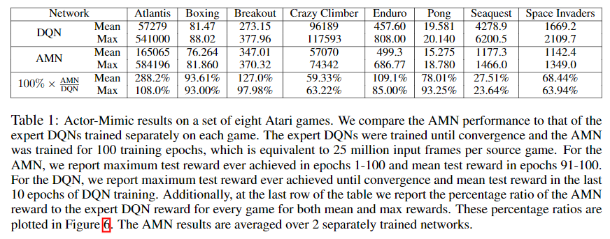
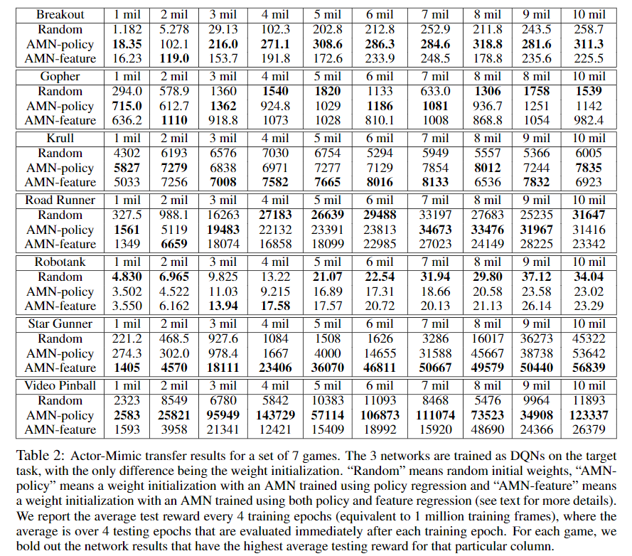

# Actor-Mimic

> [Actor-Mimic: Deep Multitask and Transfer Reinforcement Learning](https://arxiv.org/pdf/1511.06342.pdf)

在多种环境中行动并将先前的知识转移到新环境中的能力可以被认为是任何智能代理的一个关键方面。为了实现这个目标，我们定义了一种新的多任务和迁移学习方法，使自主代理能够同时学习如何在多个任务中运行，然后将其知识推广到新的领域。这种被称为“Actor-Mimic”的方法利用深度强化学习和模型压缩技术来训练一个单一的策略网络，该网络通过几个专家教师的指导来学习如何在一系列不同的任务中行动。然后，我们证明了深层策略网络所学习到的表征能够在没有专家指导的情况下普遍适用于新的任务，加快了在新环境中的学习。虽然我们的方法通常可以应用于广泛的问题，但是我们使用雅达利游戏作为测试环境来演示这些方法。

本算法和Policy Distillation类似，均为用学生网络提取多个专用网络的策略，实现多任务学习。

## 方法

### POLICY REGRESSION OBJECTIVE

令Actor-Mimic网络输出的策略为

$$
\pi_{E_{i}}(a | s)=\frac{e^{\tau^{-1} Q_{E_{i}}(s, a)}}{\sum_{a^{\prime} \in \mathcal{A}_{E_{i}}} e^{\tau^{-1} Q_{E_{i}}\left(s, a^{\prime}\right)}}
$$

损失函数为学生网络与指导网络输出的交叉熵

$$
\mathcal{L}_{\text {policy}}^{i}(\theta)=\sum_{a \in \mathcal{A}_{E_{i}}} \pi_{E_{i}}(a | s) \log \pi_{\mathrm{AMN}}(a | s ; \theta)
$$

### FEATURE REGRESSION OBJECTIVE

$$
\mathcal{L}_{\text {FeatureRegression}}^{i}\left(\theta, \theta_{f_{i}}\right)=\left\|f_{i}\left(h_{\mathrm{AMN}}(s ; \theta) ; \theta_{f_{i}}\right)-h_{E_{i}}(s)\right\|_{2}^{2}
$$

隐藏层套上一个f转换器后用L2损失指导训练

### ACTOR-MIMIC OBJECTIVE

$$
\mathcal{L}_{\text {ActorMimic}}^{i}\left(\theta, \theta_{f_{i}}\right)=\mathcal{L}_{p o l i c y}^{i}(\theta)+\beta * \mathcal{L}_{F \text { eatureRegression }}^{i}\left(\theta, \theta_{f_{i}}\right)
$$

两个损失混合起来训练

### CONVERGENCE PROPERTIES OF ACTOR-MIMIC

本节分析算法收敛性质，暂略

## 实验

多任务学习测试

迁移学习测试

