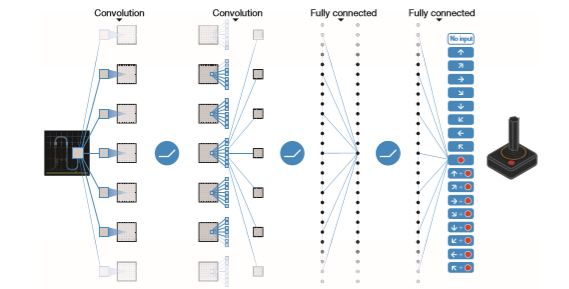

# DQN

## 介绍

> [Playing atari with deep reinforcement learning](https://arxiv.org/pdf/1312.5602v1.pdf)

我们提出了第一个深度学习模型，使用强化学习直接从高维感觉输入成功学习控制策略。 该模型是卷积神经网络，使用Q学习的变体进行训练，其输入是原始像素，其输出是估计未来奖励的值函数。 我们将方法应用于Arcade学习环境中的七个Atari 2600游戏，不需要调整架构或学习算法。 我们发现它在六个游戏中优于以前的所有方法，并且在三个游戏中超过了人类专家。

## 算法

最优贝尔曼方程

$$Q^{*}(s, a)=\mathbb{E}_{s^{\prime} \sim \mathcal{E}}\left[r+\gamma \max _{a^{\prime}} Q^{*}\left(s^{\prime}, a^{\prime}\right) | s, a\right]$$

在DQN中使用一个卷积神经网络拟合上面的Q函数，损失函数如下

$$L_{i}\left(\theta_{i}\right)=\mathbb{E}_{s, a \sim \rho(\cdot)}\left[\left(y_{i}-Q\left(s, a ; \theta_{i}\right)\right)^{2}\right]$$

其中 $$y_{i}=\mathbb{E}_{s^{\prime} \sim \mathcal{E}}\left[r+\gamma \max _{a^{\prime}} Q\left(s^{\prime}, a^{\prime} ; \theta_{i-1}\right) | s, a\right]$$

### 探索利用

在选择下一步应该执行的动作时，以 $$\epsilon$$ 的概率选择一个随机动作，以 $$1-\epsilon$$ 的概率选择Q值最大的动作

### 经验回放

历史数据以 $$(st，at，rt+1，st + 1 )$$ 形式的储存在经验池中，并在网络更新时随机批采样。这使得该算法能够重用并从过去和不相关的经验中获益，这减少了更新的差异。

### 目标网络

为了提高训练的稳定性，算法中有两个网络，其一是最新的行为网络，其二是目标网络。目标网络每C步和当前最新的网络同步一次。

## 伪代码

