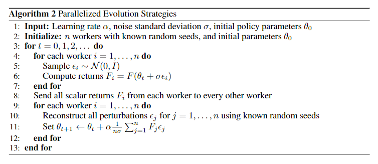

# ES

## 介绍

> [Evolution Strategies as a Scalable Alternative to Reinforcement Learning](https://arxiv.org/pdf/1703.03864.pdf)

我们探索使用Evolution Strategies（ES），一类黑盒优化算法，作为基于MDP的流行RL技术的替代方案，如Q-learning和Policy Gradients。 MuJoCo和Atari上的实验表明，ES是一种可行的解决方案策略，可以根据可用的CPU数量进行非常好的扩展：通过使用基于常见随机数的新型通信策略，我们的ES实现只需要传达标量，使其可以扩展到超过一千个并行进程。 这使我们能够在10分钟内解决3D人体行走，并在训练一小时后获得大多数Atari游戏的竞争结果。 此外，我们强调了作为黑盒优化技术的ES的几个优点：它不受行动频率和延迟奖励的影响，能够容忍极长的视野，并且不需要temporal discounting或值函数逼近。

本文的主要发现如下：

1. 我们发现使用虚拟批量标准化极大地提高了进化策略的可靠性。 如果没有这些方法，ES在我们的实验中证明是脆弱的，但通过这些重新参数化，我们在各种环境中取得了很好的结果。
2. 我们发现进化策略方法可高度并行化：通过引入基于常见随机数的新型通信策略，即使使用超过一千名工作人员，我们也能够在运行时实现线性速度。 特别是，使用1,440个工作进程，我们能够在10分钟内解决MuJoCo 3D人形任务。
3. 进化策略的数据效率惊人地好:我们能够匹配A3C 在大多数Atari环境中，使用的数据量在3倍到10倍之间。由于没有执行反向传播和没有值函数，所需的计算量减少了大约3倍，这在一定程度上抵消了数据效率的轻微下降。ES1小时训练结果需要的计算量与A3C1天训练结果相同，而在23个游戏测试上表现更好，在28个上表现更差。在MuJoCo任务中，我们能够匹配信任区域策略优化，使用的数据最多不超过10倍。
4. 我们发现ES表现出比像TRPO这样的策略梯度方法更好的探索行为:在MuJoCo人形机器人任务中，ES已经能够学习各种各样的步态\(比如侧向行走或者向后行走\)。TRPO从未观察到这些不寻常的步态，这表明了一种本质上不同的勘探行为
5. 我们发现进化策略方法是稳健的:对于所有Atari环境，我们使用固定超参数实现了上述结果，对于所有MuJoCo环境，我们使用了一组不同的固定超参数\(一个二元超参数除外，它在不同的MuJoCo环境中并不保持恒定\)

## 算法

### 进化策略

进化算法的常规流程为：初始种群&gt;&gt;交叉变异&gt;&gt;评价&gt;&gt;筛选下一代......直到问题收敛

令 $$F$$ 为评价函数， $$\theta$$ 为策略的参数，带噪音的分布 $$p_{\psi}(\theta)$$ 为当前的策略种群

则优化的最终目标是最大化 $$\mathbb{E}_{\theta \sim p_{\psi}} F(\theta)$$ ，natural evolution strategies \(NES\)使用梯度

$$\nabla_{\psi} \mathbb{E}_{\theta \sim p_{\psi}} F(\theta)=\mathbb{E}_{\theta \sim p_{\psi}}\left\{F(\theta) \nabla_{\psi} \log p_{\psi}(\theta)\right\}$$

我们用多元高斯分布来生成噪音，则可得到梯度

$$\nabla_{\theta} \mathbb{E}_{c \sim N(0, I)} F(\theta+\sigma \epsilon)=\frac{1}{\sigma} \mathbb{E}_{c \sim N(0, I)}\{F(\theta+\sigma \epsilon) \epsilon\}$$

于是有算法1

这里初始种群为带扰动的初始策略网络，评价函数视为环境的回报，基于评价函数用梯度下降产生下一代群体。

### 进化策略的扩展和并行化

ES非常适合扩展到许多并行工作者：1）它在完整的episode上运行，因此只需要进程之间的不频繁通信。 2）每个进程获得的唯一信息是episode的标量返回：如果我们在优化之前在进程之间同步随机种子，每个进程都知道其他进程使用了什么扰动，因此每个进程只需要与另一个进程之间传递单个标量同意参数更新。3 \)它不需要值函数近似。具有值函数估计的RL本质上是连续的:为了改进给定的策略，通常需要对值函数进行多次更新来获得足够的信号。因此该算法可以有效的扩展到上千个工作进程。

ES的探索由参数扰动驱动，对于ES来改进参数 $$θ$$ ，种群中的一些成员必须获得比其他成员更好的回报：即高斯扰动向量偶尔导致新的个体 $$\theta+\sigma \epsilon$$ 具有更好的回报是至关重要的。

对于Atari环境，我们发现DeepMind的卷积体系结构上的高斯参数扰动并不总能导致充分的探索：对于某些环境，随机扰动的参数倾向于编码总是采取一种特定反应的策略，而不管 作为输入的状态。 但是，我们发现通过在策略规范中使用虚拟批量规范化，我们可以匹配大多数游戏的策略梯度方法的性能。

### 参数空间中的平滑 vs 动作空间中的平滑

RL的一大困难来源于缺乏策略的信息梯度：这种梯度可能由于环境或策略的不平滑而不存在，或者可能只能作为高方差估计来获得，因为环境通常只能通过采样来访问。令 $$\mathbf{a}=\left\{a_{1}, \dots, a_{T}\right\}$$ ，其中 $$a_{t}=\pi(s ; \theta)$$， 则我们的优化目标为 $$F(\theta)=R(\mathbf{a}(\theta))$$ 。

因为允许动作是离散的，并且允许策略是确定性的， $$F(\theta)$$ 可能是非平滑的；更重要的是，因为我们不能明确地访问决策问题的潜在状态转移函数，梯度不能用类似反向传播的算法来计算。为了使问题变得平滑并有一种方法来估计它的梯度，我们需要添加噪声。

策略梯度方法在动作空间添加噪音 $$\epsilon$$ ，所以目标函数为 $$F_{P G}(\theta)=\mathbb{E}_{\epsilon} R(\mathbf{a}(\epsilon, \theta))$$ ，梯度为

$$
\nabla_{\theta} F_{P G}(\theta)=\mathbb{E}_{\epsilon}\left\{R(\mathbf{a}(\epsilon, \theta)) \nabla_{\theta} \log p(\mathbf{a}(\epsilon, \theta) ; \theta)\right\}
$$

对于进化策略，这里使用的方法是基于参数扰动的噪音，即参数 $$\tilde{\theta}=\theta+\xi$$ ，$$a_{t}=\mathbf{a}(\xi, \theta)=\pi(s ; \tilde{\theta})$$

$$
\nabla_{\theta} F_{E S}(\theta)=\mathbb{E}_{\xi}\left\{R(\mathbf{a}(\xi, \theta)) \nabla_{\theta} \log p(\tilde{\theta}(\xi, \theta) ; \theta)\right\}
$$

