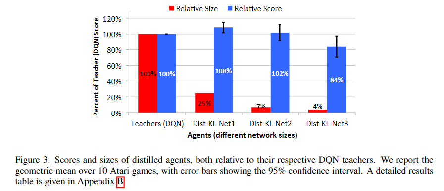

# Policy Distillation

> [POLICY DISTILLATION](https://arxiv.org/pdf/1511.06295.pdf)

通过深度强制学习，使用称为深度Q网络（DQN）的方法成功地学习了复杂视觉任务的策略，但是需要相对较大的（任务特定的）网络和广泛的培训来实现良好的性能。 在这项工作中，我们提出了一种称为Policy Distillation的新方法，该方法可用于提取强化学习代理的策略，并训练在专家级执行的新网络，同时显着缩小和提高效率。 此外，可以使用相同的方法将多个特定于任务的策略合并到单个策略中。我们使用Atari领域来演示这些声明，并表明多任务Distillation代理优于单一任务以及联合培训的DQN代理。

在本文中，我们介绍了将一个或多个动作策略从q网络转移到未训练网络的策略Distillation。该方法具有多种优点:网络大小可以被压缩多达15倍，而不会降低性能；多个专家策略可以组合成一个单一的多任务策略，其性能优于原始专家；最后，它可以作为一个实时的在线学习过程，通过不断提取最佳策略到目标网络，从而有效地跟踪不断发展的问题学习策略。这项工作的贡献是描述和讨论策略Distillation方法，并展示\( a \)单一游戏Distillation，\( b \)具有高度压缩模型的单游戏Distillation，\( c \)多游戏Distillation，和\( d \)在线Distillation的结果。

## 方法

### Deep Q-Learning

在深度Q学习中，神经网络被训练以预测的每个可能动作的平均折扣未来奖励。 具有最高预测奖励的动作由即应选择的动作。定义状态动作序列 $$s_{t}=x_{1}, a_{1}, x_{2}, a_{2}, \dots, a_{t-1}, x_{t}$$ ，折扣回报 $$\gamma : R_{t}=\sum_{t^{\prime}=t}^{T} \gamma^{t^{\prime}-t} r_{t}$$以及Q函数:

$$
Q^{*}(s, a)=\max _{\pi} \mathbb{E}\left[R_{t} | s_{t}=s, a_{t}=a, \pi\right]
$$

DQN通过最小化以下损失函数进行训练：

$$
L_{i}\left(\theta_{i}\right)=\mathbb{E}_{\left(s, a, r, s^{\prime}\right) \sim U(D)}\left[\left(r+\gamma \max _{a^{\prime}} Q\left(s^{\prime}, a^{\prime} ; \theta_{i}^{-}\right)-Q\left(s, a ; \theta_{i}\right)\right)^{2}\right]
$$

### SINGLE-GAME POLICY DISTILLATION

DISTILLATION\(蒸馏\)是一种将知识从指导模型转移到学生模型的方法。

用 $$T$$ （指导网络）生成的样本训练 $$S$$ （学生网络），可分类三种方式：

1\)选择最大Q值作为正类，利用负的对数似然损失，

$$
L_{\mathrm{NLL}}\left(\mathcal{D}^{T}, \theta_{S}\right)=-\sum_{i=1}^{|D|} \log P\left(a_{i}=a_{i, b e s t} | x_{i}, \theta_{S}\right)
$$

2\)利用Q值得MSE损失

$$
L_{M S E}\left(\mathcal{D}^{T}, \theta_{S}\right)=\sum_{i=1}^{|D|}\left\|\mathbf{q}_{i}^{T}-\mathbf{q}_{i}^{S}\right\|_{2}^{2}
$$

3\)将 $$Q$$ 值转换成离散概率，然后用KL散度作为损失

$$
L_{K L}\left(\mathcal{D}^{T}, \theta_{S}\right)=\sum_{i=1}^{|D|} \operatorname{softmax}\left(\frac{\mathbf{q}_{i}^{T}}{\tau}\right) \ln \frac{\operatorname{softmax}\left(\frac{\mathbf{q}_{i}^{T}}{\tau}\right)}{\operatorname{softmax}\left(\mathbf{q}_{i}^{S}\right)}
$$

在传统的分类设置中， $$\mathbf{q}^{T}$$ 的输出分布非常尖锐，因此通过提高 $$softmax$$ 的温度参数来软化分布，以允许更多的次要知识转移到学生。

### MULTI-TASK POLICY DISTILLATION

我们使用N个DQN单游戏专家，每个都经过单独训练。 这些代理产生输入和目标，只需单游戏蒸馏，数据存储在单独的内存缓冲区中。 蒸馏器然后从数据存储顺序学习，每一集切换到不同的一个。由于不同的任务通常具有不同的动作集，因此为每个任务训练单独的输出层（称为控制器层）并且任务的id用于切换 在训练和评估期间得到正确的输出。 我们还尝试了KL和NLL蒸馏损失功能，用于多任务学习。

即使有了单独的控制器，多游戏DQN学习对Atari游戏来说也是极具挑战性的，DQN通常无法在游戏中达到完整的单游戏性能。我们认为这是由于不同政策之间的干扰、不同的奖励尺度以及学习价值函数固有的不稳定性。

策略提炼可以提供一种方法，将多个策略组合到一个网络中，而不会带来破坏性的干扰和扩展问题。由于策略在提炼过程中被压缩和提炼，我们推测它们也可以更有效地组合成单个网络。此外，策略固有的方差低于价值函数，这将有助于性能和稳定性。

## 实验

