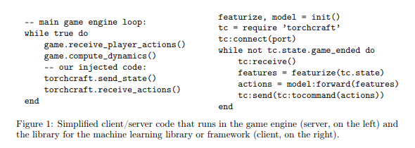
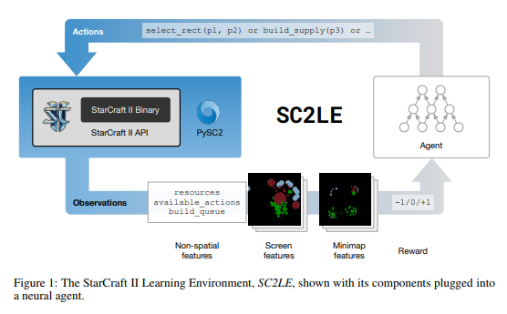

# 即时战略游戏

## TorchCraft

> [TorchCraft: a Library for Machine Learning Research on Real-Time Strategy Games](https://arxiv.org/pdf/1611.00625.pdf)

我们展示了TorchCraft，这是一个能够实现对星际争霸：母巢之战等实时战略（RTS）游戏进行深度学习研究的库，通过机器学习框架更容易控制这些游戏，比如Torch。

## SC2LE

> [ StarCraft II: A New Challenge for Reinforcement Learning](https://arxiv.org/pdf/1708.04782v1.pdf)

本文介绍了基于星际争霸2游戏的强化学习环境SC2LE \(StarCraft II Learning Environment\)。这一领域对强化学习提出了一个新的巨大挑战，它代表了一个比以往大多数工作中所考虑的更困难的一类问题。这是一个多智能体、多参与者交互的问题;局部观测的地图信息不完整;动作空间大，涉及数百个单元的选择和控制;它的状态空间很大，必须仅从原始输入特征面观察;延期的信用分配需要数千步的长期策略。我们描述了《星际争霸2》领域的观察、行动和奖励规范，并提供了一个基于python的开放源码界面来与游戏引擎进行通信。除了主游戏地图，我们还提供了一套专注于《星际争霸2》游戏玩法中不同元素的迷你游戏。对于主游戏地图，我们还提供了一个来自人类专家玩家的游戏回放数据集。我们给出了训练神经网络预测游戏结果和玩家行为的初始基线结果。最后，我们给出了应用于星际争霸2领域的典型深度强化学习代理的初始基线结果。在迷你游戏中，这些代理学习如何达到与新手相当的游戏水平。然而，当在主游戏上进行训练时，这些代理无法取得显著的进展。因此，SC2LE为探索深度强化学习算法和体系结构提供了一个具有挑战性的新环境。

## ELF

> [ ELF: An Extensive, Lightweight and Flexible Research Platform for Real-time Strategy Games](https://papers.nips.cc/paper/6859-elf-an-extensive-lightweight-and-flexible-research-platform-for-real-time-strategy-games.pdf)

在本文中，我们提出了ELF，一个广泛，轻量和灵活的平台，用于基础强化学习研究。 使用ELF，我们实现了一个高度可定制的实时战略（RTS）引擎，具有三种游戏环境（Mini-RTS，夺旗和塔防）。 Mini-RTS作为星际争霸的缩影版，捕捉关键的游戏动态，并在笔记本电脑上以每核心40K帧速（FPS）运行。 结合现代强化学习方法，该系统可以在一天内通过6个CPU和1个GPU训练一个完整的游戏机器人对抗内置AI端到端。 此外，我们的平台在环境代理通信拓扑，RL方法选择，游戏参数变化方面具有灵活性，并且可以托管现有的基于C / C ++的游戏环境 像ALE一样。使用ELF，我们彻底探索训练参数，并显示在Mini-RTS的完整游戏中，具有Leaky ReLU 和批量标准化以及长视野训练和渐进式课程的网络70％的时间超过基于规则的内置AI 。 其他两场比赛也取得了很好的表现。 在游戏回放中，我们展示了我们的代理商学习有趣的策略。 ELF及其RL平台的开放源代码在：[https://github.com/facebookresearch/ELF。](https://github.com/facebookresearch/ELF。)

