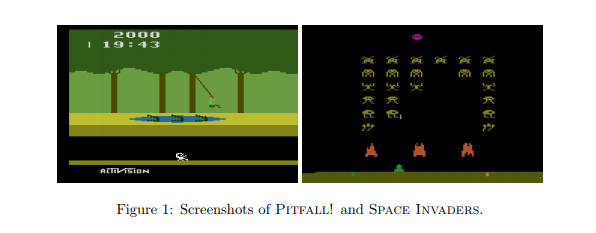
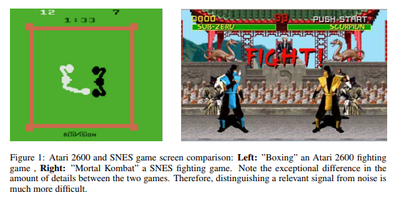

# 街机游戏

## Arcade  Learning  Environment

> [The Arcade Learning Environment: An Evaluation Platform for General Agents](https://arxiv.org/pdf/1207.4708.pdf)

ALE为数百个Atari 2600游戏环境提供了一个界面，每个环境都是不同的，有趣的，并且设计成对人类玩家的挑战。 ALE为强化学习，模型学习，基于模型的规划，模仿学习，转移学习和内在动机提出了重大的研究挑战。最重要的是，它提供了一个严格的测试平台，和这些问题的评估比较方法。我们使用完善的AI技术（包括强化学习和规划）设计的独立代理和基准测试来说明ALE的前景。在此过程中，我们还提出了ALE实现的评估方法，报告了超过55种不同游戏的实证结果。所有软件（包括基准代理）都是公开的。

## Retro Learning Environment

> [Playing SNES in the Retro Learning Environment](https://arxiv.org/pdf/1611.02205.pdf)

经典街机游戏的另一个平台是RLE，它目前包含了为超级任天堂娱乐系统\(SNES\)发布的几款游戏。这些游戏都有3D图形，控制器允许720多种动作组合。因此SNES游戏比Atari 2600游戏更加复杂和现实，但RLE却没有ALE那么受欢迎。

RLE可以在超级任天堂娱乐系统（SNES），Sega Genesis和其他几款游戏机上运行游戏。该环境是可扩展的，允许添加更多视频游戏和控制台到环境中，同时保持与ALE相同的界面。而且，RLE与Python和Torch兼容。 SNES游戏由于其更高的复杂性和多功能性而对当前算法构成了重大挑战。

## General Video Game AI framework

> [ Deep Reinforcement Learning for General Video Game AI](https://arxiv.org/pdf/1806.02448.pdf)

通用电子游戏AI \(GVGAI\)竞赛及其相关软件框架为大量使用特定领域描述语言编写的游戏提供了一种对AI算法进行基准测试的方法。尽管人们对这项竞赛很感兴趣，但迄今为止，它一直专注于在线规划，提供一种允许使用蒙特卡洛树搜索等算法的正向模型。

在本文中，我们描述了如何将GVGAI接口到OpenAI Gym环境，这是一种广泛使用的连接代理到强学习问题的方法。使用这个接口，我们描述了几种深度强化学习算法的广泛应用在许多GVGAI游戏中的表现。我们进一步分析结果，以提供第一个指标，描述这些游戏的相对难度，包括ALE中的游戏。

