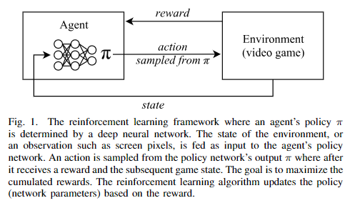

# 神经网络学习算法

## 监督学习

在监督学习中，通过实例训练模型。在培训过程中，要求模型做出正确答案已知的决策。误差，即所提供的答案与预测值之间的差异，被用来作为损失来更新模型。我们的目标是建立一个超越训练数据的模型，从而在它从未见过的例子上表现出色。大数据集通常可以提高模型的泛化能力。

在游戏中，这些数据可以来自游戏轨迹（即人们在玩游戏的记录），允许代理基于人类在动作状态下执行的动作来学习从输入状态到输出动作的映射。 如果游戏已经通过另一种算法解决，它可以用于生成训练数据，如果第一种算法太慢而无法实时运行，这将非常有用。 虽然学习从现有数据中学习可以让代理人快速学习最佳实践，但它往往很脆弱; 可用的数据可能很昂贵，并且可能缺少代理应该能够处理的关键方案。 对于游戏玩法，该算法仅限于数据中可用的策略，并且不能探索新的内容。 因此，在游戏中，监督算法通过强化学习算法与额外的训练相结合。

游戏中监督学习的另一个应用是学习游戏的状态转换。神经网络可以学习预测动作状态对的下一个状态，而不是提供给定状态的动作。因此，网络本质上是在学习一个游戏模型，然后可以用来更好地玩游戏或进行规划

## 无监督学习

非监督学习的目的不是学习数据与其标签之间的映射，而是发现数据中的模式。这些算法可以了解数据集的特征分布，这些特征可以用来聚类相似的数据，将数据压缩成其基本特征，或者创建新的合成数据，这是原始数据的特征。对于奖励稀少的游戏\(如蒙特祖玛的复仇\)，以无监督的方式从数据中学习是一个潜在的解决方案，也是一个重要的开放式深度学习挑战

深度学习中一种突出的无监督学习技术是自动编码器，它是一种神经网络，试图学习恒等函数，使得输出与输入相同。 该网络由两部分组成：一个将输入x映射到低维隐藏向量h的编码器，以及一个试图从x重构的解码器。主要思想是通过保持h很小，网络通过压缩数据，从而学会了一个好的 表示。 研究人员开始将这种无监督算法应用于游戏，以帮助提取有意义的低维数据的高维数据，但这种研究方向仍处于早期阶段。

## 强化学习

在强化学习（RL）中，代理通过与向代理提供奖励信号的环境交互来学习行为。 视频游戏可以很容易地被建模为RL设置中的环境，其中玩家被建模为具有可以在每个步骤采取的有限动作集的代理人，并且奖励信号可以由游戏分数确定。

在RL中，代理依赖于奖励信号。 这些信号可以经常出现，例如游戏中的得分变化，也可以很少出现，例如直到代理人赢或输了游戏才出现。 电子游戏和RL可以很好地结合在一起，因为大多数游戏都会为成功的策略带来回报。开放世界游戏通常并没有明确的奖励模型，所以对RL算法具有挑战性。

在稀疏的游戏中应用RL的一个关键挑战是，当获得奖励信号时，如何给许多先前的动作分配信用。各州的回报需要传播回导致回报的行动。从历史上看，这个问题有几种不同的处理方法，如下所述。如果一个环境可以被描述为马尔可夫决策过程，那么代理可以建立一个未来状态及其回报的概率树。概率树可以用来计算当前状态的Utility。对于RL代理，这意味着学习模型 $$p (s′| s, a )$$ ，其中P是给定状态s和动作的概率a转移到s'的概率。

$$
U(s)=R(s)+\gamma \max {a} \sum{s^{\prime}} P\left(s^{\prime} | s, a\right) U\left(s^{\prime}\right)
$$

其中γ是未来状态Utility的贴现因子。这种被称为自适应动态规划\(ADP\)的算法可以很快收敛，因为它直接处理信用分配问题。问题是它必须在整个问题空间上建立一个概率树，因此对于大问题来说是难以解决的。由于这项工作中涉及的游戏被认为是“大问题”，我们将不再详细讨论这个算法。

解决这个问题的另一种方法是时间差分学习。在TD学习中，代理直接基于当前Utylity等于当前回报加上下一个状态的Utility类学习Utility。它不是学习状态转换模型，而是学习为每个状态建立Utility模型。

$$
U(s)=U(s)+\alpha\left(R(s)+\gamma U\left(s^{\prime}\right)-U(s)\right)
$$

其中 $$\alpha$$ 是算法的学习速率。上面的等式没有考虑如何选择 $$s'$$ 。如果在 $$s(t)$$ 处发现了回报，它只会影响$$s(t)$$ 。下一次当代理在状态 $$s(t-1)$$ 时，那么 $$U(s(t-1))$$ 将会知道未来的回报。它会随着时间向后传播。同样，出现频率较低的状态转移对Utility的影响较小。因此， $$U$$ 会收敛到与ADP相同的值，尽管速度较慢。

TD还有其他的实现，可以学习状态-动作对的奖励。这允许代理在给定状态的情况下选择动作，而不需要转换到未来状态的模型。因此，这些方法被称为无模型方法。一种流行的无模型RL方法是Q学习，其中状态的Utility等于状态的最大Q值。Q学习的更新方程为

$$
Q(s, a)=Q(s, a)+\alpha\left(R(s)+\gamma \max _{g^{\prime}} Q\left(s^{\prime}, a^{\prime}\right)-Q(s, a)\right)
$$

在Q学习中，通过选择最着名的未来状态 - 动作对来考虑未来的奖励。 在类似的SARSA（State-Action-Reward-State-Action）算法中， $$Q(s, a)$$ 仅在选择的下一个 $$a$$ 和 $$s$$ 已知时才更新，且使用此动作对而不是最大Q值。 这使得SARSA的on-policy与Q学习形成鲜明对比，因为SARSA的行为策略与目标策略是一致的。

Q-learning和SARSA可以使用神经网络作为q函数的函数逼近器。给定的Q 更新方程可用于为状态-动作对提供新的期望Q值。网络可以像监督学习那样被更新

代理的策略决定了在给定状态下要采取的操作。对于Q学习，一个简单的策略是总是采取Q值最高的行动。然而，在训练的早期，Q值不是很准确，一个代理可能总是利用一点点奖励而陷入困境。一个学习者应该优先探索新的行动以及利用所学的知识。这个问题被认为是一个多臂赌博机问题。 $$\epsilon$$ -greedy策略是一种简单的方法，用 $$\epsilon$$ 概率选择（估计的）最优动作，否则选择随机动作。

RL的一种方法是在策略的参数空间中执行梯度下降，假设 $$\pi_{\theta}(s, a)$$ 是在给定参数θ的状态下采取行动的概率。来自REINFORCE算法族的基本策略梯度算法使用梯度 $$\nabla_{\theta} \sum_{a} \pi_{\theta}(s, a) R(s)$$ 更新参数。其中 $$R(s)$$ 是从状态 $$s$$ 向前获得的折扣累积奖励。 在实践中，从策略中采样动作样本并且更新网络参数，可以增加最成功的动作的概率。这非常适合神经网络，因为是 $$\pi$$ 神经网络 $$\theta$$是 网络权重。

Actor-Critic方法将策略梯度方法与TD学习相结合，actor使用梯度下降学习策略 $$\pi_{\theta}(s, a)$$ ，critic使用TD学习近似 R。总之，它们是迭代学习策略的有效方法。 在Actor-Critic方法中，可以用同一个网络来预测 $$\pi$$ 和R，或两个独立的网络。

## 演化计算

到目前为止所讨论的优化技术依赖于梯度下降，这是基于定义误差的微分。然而，无导数优化方法如进化算法也被广泛用于训练神经网络，包括但不限于强化学习任务。这种方法通常被称为神经进化，可以优化网络的权重以及拓扑/架构。由于其通用性，NE方法已广泛应用于不同类型的视频游戏。

与基于梯度下降的训练方法相比，神经网络方法具有不要求网络是可微分的优点，并且可以应用于有监督、无监督和强化学习问题。进化拓扑结构和权重的能力有可能提供一种自动开发神经网络架构的方法，这种方法目前需要相当多的领域知识。这些技术的前景是进化可以找到一种神经网络拓扑，它比现有的人类设计的体系结构更擅长玩某种游戏。虽然传统上神经网络被应用于输入维数比典型的深度学习方法低的问题，最近Salimans等人表明，在给定足够的计算资源的情况下，依赖于通过随机噪声而不是计算梯度的参数探索的演化策略，在Atari视频游戏上可以获得与当前深度RL方法相竞争的结果。

## 混合学习算法

最近，研究人员开始研究视频游戏的混合学习算法，将深度学习方法与其他机器学习方法相结合。Alvernaz和lius以及Poulsen等人都尝试将一个通过梯度下降训练的深度网络结合起来，将一个浓缩的特征表征输入一个通过演化训练的网络中。这些混合的目标是结合这两种方法的优点，因为深度学习方法能够直接从高维的输入中学习，而演化方法不依赖于可微分的架构，并且在稀疏的情况下也能很好地工作。一些结果表明，无梯度方法在训练的早期阶段似乎更好，以避免早熟收敛，而基于梯度的方法可能最终更好。

一种棋盘游戏的混合学习算法是AlphaGo，它依靠深度神经网络和蒙特卡洛树搜索击败了围棋世界冠军。

