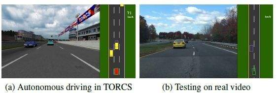

# 竞速游戏

玩家的任务是控制某种车辆或角色，以便在尽可能短的时间内达到一个目标，或者在给定的时间内沿着一条赛道尽可能远地行进。通常，游戏从玩家控制的车辆后面采用第一人称视角或有利位置。绝大多数游戏都采用连续输入信号作为转向输入，类似于方向盘。

## TORCS

> [TORCS: The open racing car simulator](http://pdfs.semanticscholar.org/b9c4/d931665ec87c16fcd44cae8fdaec1215e81e.pdf)

开放赛车模拟器是一个现代化的，模块化的，高便携的多玩家，多代理的赛车模拟器。它具有高度的模块化和可移植性，是人工智能研究的理想对象。事实上，已经出现了一些使用TORCS引擎的研究性比赛和论文。本文的目的是将TORCS的结构介绍给一般的人工智能和机器学习社区，并解释如何在平台上测试agent。

TORCS可以用于开发针对各种问题的人工智能\(AI\)代理。在汽车层面，可以开发新的仿真模块，包括各种汽车零部件的智能控制系统。在驱动程序级别，低级API提供对模拟状态的详细\(但只是部分\)访问。这可以用于开发任何东西，从中级控制系统到复杂的驾驶代理，找到最佳的赛车路线，在意外情况下成功地作出反应，并作出良好的战术比赛决策。最后，对于喜欢挑战和对视觉处理感兴趣的研究人员来说，3d投影接口也是可用的

