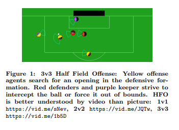

# 团队体育游戏

流行的体育游戏通常基于基于团队的游戏，如足球、篮球和足球。这些游戏旨在通过逼真的动画和3D图形尽可能逼真。在一年一度的机器人世界杯足球赛\( RoboCup \)中，一些类似足球的环境被广泛用作研究平台，包括物理机器人和2D/3D模拟

## Keepaway Soccer

> [Keepaway Soccer: From Machine Learning Testbed to Benchmark](https://www.cs.utexas.edu/~pstone/Papers/bib2html-links/LNAI2005-keepaway.pdf)

Keepaway soccer曾被提出作为机器学习的测试平台。尽管许多研究人员已经成功地将其用于机器学习实验，但这样做需要大量的领域专业知识。本文介绍了一组程序、工具和资源，这些程序、工具和资源旨在使该领域在不了解RoboCup或足球服务器的情况下易于用于实验。此外，我们还报告了Keepaway领域的新实验，以及设计成可与未来实验结果直接比较的性能结果。结合起来，新的基础设施和我们在对比实验中对其使用的具体演示，将该领域提升到了一个机器学习基准，适合该领域的研究人员使用。

## Half Field Offense

> [Half Field Offense: An Environment for Multiagent Learning and Ad Hoc Teamwork](https://pdfs.semanticscholar.org/6c74/4d367698c5f1059a3ac312ea91ebd1460d52.pdf)

二十多年来，RoboCup 2D仿真领域一直是人工智能，机器学习和多代理系统研究的平台。然而，对于希望快速制作原型并评估不同算法的研究人员而言，完整的RoboCup任务呈现出繁琐的前景，因为可能需要数周才能建立所需的测试环境。复杂性部分归功于几个代理的协调，每个代理都具有多层控制层次，并且必须平衡攻击性和防御性目标。本文介绍了一种新的开源基准测试，它基于足球的半场防守子任务，作为一个易于使用的实验平台。在保留足球固有挑战的同时，HFO环境限制了代理人对决策的关注，提供了与环境和其他代理交互的标准化界面，以及用于评估绩效的标准化工具。由此产生的测试平台可以方便地测试单个和多个学习，特设团队和模仿学习的算法。除了对HFO环境的详细描述外，我们还针对各种HFO任务提供了强化学习代理的基准测试结果。我们还强调了HFO环境为未来研究开辟的其他几个挑战。

